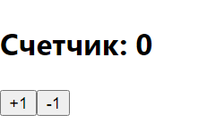
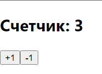
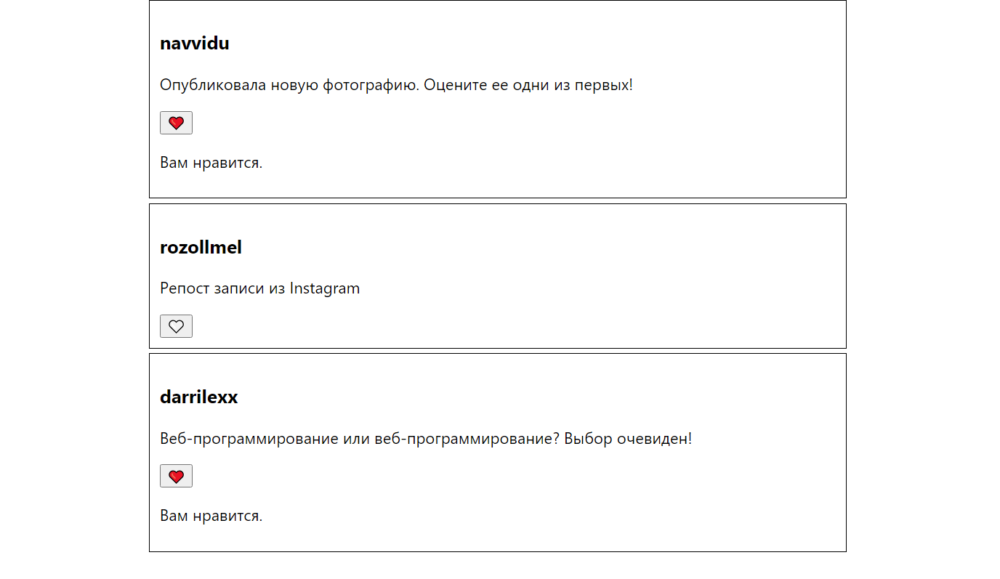
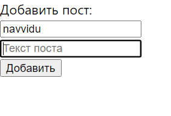
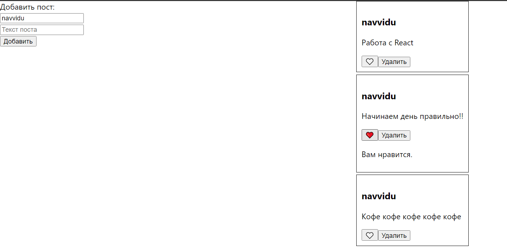
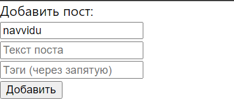
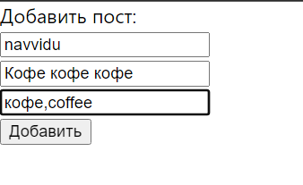
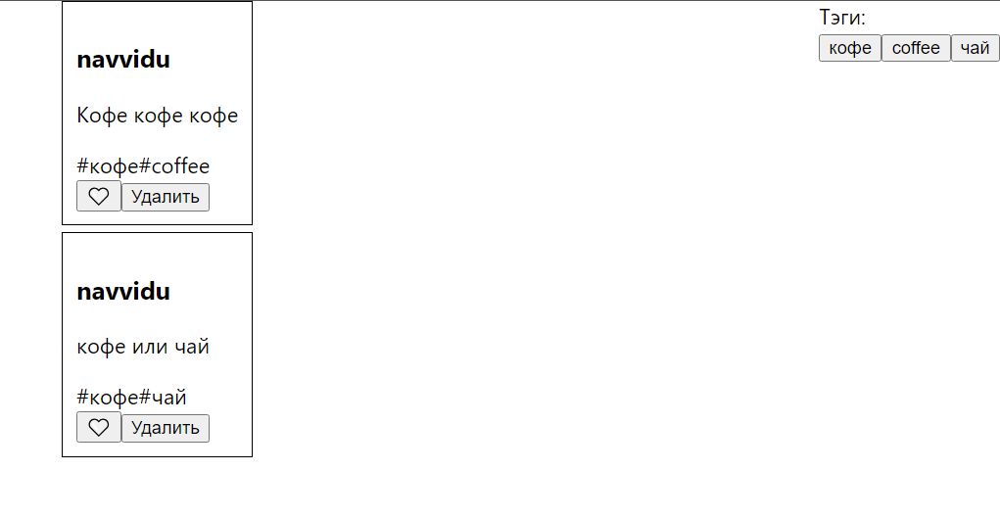
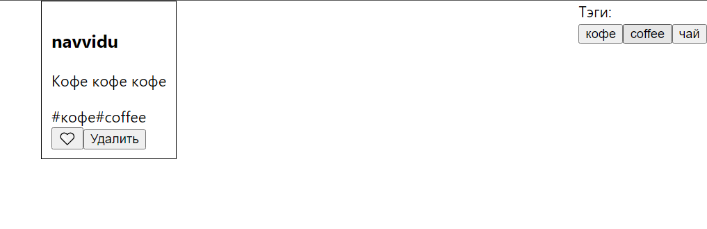

# Знакомство с React.
___________________________________________________
## Лабораторная работа №9
#### Задание №1. создать обычный счетчик
Файл App.js
```shell
import React, { useState } from 'react';

function Counter() {
    const [count, setCount] = useState(0);

    const increment = () => {
        setCount(count + 1);
    };

    const decrement = () => {
        setCount(count - 1);
    };

    return (
        <div>
            <h2>Счетчик: {count}</h2>
            <button onClick={increment}>+1</button>
            <button onClick={decrement}>-1</button>
        </div>
    );
}

export default Counter;
```
 
 #### Задание №2. создать список постов пользоваталей, пост должен принимать имя пользователя, текст в посте, так же добавить возможность лайкать посты и визуально показывать лайнутый пост
Файл App.js
```shell
import './App.css';
import React, { useState } from 'react';

function Post({ username, text }) {
  const [liked, setLiked] = useState(false);

  const handleLike = () => {
    setLiked(!liked);
  };

  return (
    <div className="post">
      <h3>{username}</h3>
      <p>{text}</p>
      <button onClick={handleLike}>{liked ? '❤️' : '🤍'}</button>
      {liked && <p>Вам нравится.</p>}
    </div>
  );
}

function PostList() {
  const posts = [
    { id: 1, username: 'navvidu', text: 'Опубликовала новую фотографию. Оцените ее одни из первых!' },
    { id: 2, username: 'rozollmel', text: 'Репост записи из Instagram' },
    { id: 3, username: 'darrilexx', text: 'Веб-программирование или веб-программирование? Выбор очевиден!' },
  ];

  return (
    <div className="post-list">
      {posts.map(post => (
        <Post key={post.id} username={post.username} text={post.text} />
      ))}
    </div>
  );
}

export default PostList;
```
Файл App.css
```shell
...
.post {
  border: 1px solid black;
  padding: 10px;
  margin-bottom: 5px;
}
.post-list {
  max-width: 50%;
  margin: 0 auto;
}
```

#### Задание №3. Добавить возможность добавления постов и удаления
Файл App.js
```shell
import './App.css';
import React, { useState } from 'react';

function Post({ id, username, text, onDelete }) {
  const [liked, setLiked] = useState(false);

  const handleLike = () => {
    setLiked(!liked);
  };
  
  const handleDelete = () => {
    onDelete(id);
  };

  return (
    <div className="post">
      <h3>{username}</h3>
      <p>{text}</p>
      <button onClick={handleLike}>{liked ? '❤️' : '🤍'}</button>
      
      <button onClick={handleDelete}>Удалить</button>
      {liked && <p>Вам нравится.</p>}

    </div>
  );
}
// Айдишники
function NewPostForm({ onAdd }) {
  const [username, setUsername] = useState('navvidu');
  const [text, setText] = useState('');
  const [nextId, setNextId] = useState(1); 

  const handleSubmit = (e) => {
    e.preventDefault();
    const newPost = {
      id: nextId, 
      username,
      text
    };
    onAdd(newPost);
    setNextId(nextId + 1);
    setUsername('navvidu');
    setText('');
  };

  return (
    <form onSubmit={handleSubmit}>
      <label htmlFor="text">Добавить пост:</label>
      <input
        placeholder="Имя пользователя"
        value={username}
        onChange={(e) => setUsername(e.target.value)}
      />
      <input
        type="text"
        id="text"
        placeholder="Текст поста"
        value={text}
        onChange={(e) => setText(e.target.value)}
      />
      <div>
        <button type="submit">Добавить</button>
        </div>
    </form>
  );
}

function PostList() {
const [posts, setPosts] = useState([]);

  const handleAddPost = (newPost) => {
    setPosts([...posts, newPost]);
  };

  const handleDeletePost = (postId) => {
    const updatedPosts = posts.filter((post) => post.id !== postId);
    setPosts(updatedPosts);
  };

  return (
    
    <div class="container">
      <div class="new-post">
      <NewPostForm onAdd={handleAddPost} />
      </div>
      <div class="post-list">
      {posts.map((post) => (
        <Post
          key={post.id}
          id={post.id}
          username={post.username}
          text={post.text}
          onDelete={handleDeletePost}
        />
      ))}
    </div>
    </div>
  );
}

export default PostList;
```
Файл App.css
```shell
...
.post {
  border: 1px solid black;
  padding: 10px;
  margin-bottom: 5px;
}
.post-list {
  max-width: 50%;
  margin: 0 auto;
}
.container {
  display: flex;
  justify-content: space-between;
  align-items: flex-start;
}
.new-post {
  width: 20%;
}
```
 
#### Задание №4. добавить тэги к постам, выводить отдельно тэги постов без повторения тэгов, добавить возможность фильтровать события по тэгам при нажатии на них, помечать выбранные тэги
Файл App.js
```shell
import './App.css';
import React, { useState, useContext } from 'react';

const TagContext = React.createContext([]);

function Post({ id, username, text, tags, onDelete }) {
  const [liked, setLiked] = useState(false);

  const handleLike = () => {
    setLiked(!liked);
  };
  
  const handleDelete = () => {
    onDelete(id);
  };

  return (
    <div className="post">
      <h3>{username}</h3>
      <p>{text}</p>
      <div>
        {tags.map((tag) => (
          <span key={tag} className="tag">
            #{tag}
          </span>
        ))}
      </div>
      <button onClick={handleLike}>{liked ? '❤️' : '🤍'}</button>
      <button onClick={handleDelete}>Удалить</button>
      {liked && <p>Вам нравится.</p>}
    </div>
  );
}
// Айдишники
let nextId = 1;
function NewPostForm({ onAdd, posts }) {
  const [username, setUsername] = useState('navvidu');
  const [text, setText] = useState('');
  const [tags, setTags] = useState('');

  const handleSubmit = (e) => {
    e.preventDefault();
    const newPost = {
      id: nextId++, 
      username,
      text,
      tags: tags.split(',')
    };
    onAdd(newPost);
    setUsername('navvidu');
    setText('');
    setTags('');
  };

  return (
    <form onSubmit={handleSubmit}>
      <label htmlFor="text">Добавить пост:</label>
      <input
        placeholder="Имя пользователя"
        value={username}
        onChange={(e) => setUsername(e.target.value)}
      />
      <input
        type="text"
        id="text"
        placeholder="Текст поста"
        value={text}
        onChange={(e) => setText(e.target.value)}
      />
      <input
        type="text"
        placeholder="Тэги (через запятую)"
        value={tags}
        onChange={(e) => setTags(e.target.value)}
      />
      <div>
        <button type="submit">Добавить</button>
      </div>
    </form>
  );
}

function PostList() {
  const [posts, setPosts] = useState([]);
  const [tagList, setTagList] = useState([]);

  const handleAddPost = (newPost) => {
    const updatedPosts = [...posts, newPost];
    setPosts(updatedPosts);
    
    const newTags = newPost.tags.filter((tag) => !tagList.includes(tag));
    setTagList([...tagList, ...newTags]);
  };

  const handleDeletePost = (postId) => {
    const updatedPosts = posts.filter((post) => post.id !== postId);
    setPosts(updatedPosts);
  };

  const handleTagFilter = (tag) => {
    const filteredPosts = posts.filter((post) => post.tags.includes(tag));
    setPosts(filteredPosts);
  };

  return (
    <TagContext.Provider value={{ handleTagFilter }}>
      <div className="container">
        <div className="new-post">
          <NewPostForm onAdd={handleAddPost} />
        </div>
        <div className="post-list">
          {posts.map((post) => (
            <Post
              key={post.id}
              id={post.id}
              username={post.username}
              text={post.text}
              tags={post.tags} 
              onDelete={handleDeletePost}
            />
          ))}
        </div>
        <div className="tag-list">
        <label htmlFor="text">Тэги:</label>
          <TagList tags={tagList} />
        </div>
      </div>
    </TagContext.Provider>
  );
}

function TagList({ tags }) {
  const tagList = useContext(TagContext);

  return (
    <div>
      {tags.map((tag) => (
        <button key={tag} onClick={() => tagList.handleTagFilter(tag)}>
          {tag}
        </button>
      ))}
    </div>
  );
}

export default PostList;
```
Файл App.css
```shell
...
.post {
  border: 1px solid black;
  padding: 10px;
  margin-bottom: 5px;
}
.post-list {
  max-width: 50%;
  margin: 0 auto;
}
.container {
  display: flex;
  justify-content: space-between;
  align-items: flex-start;
}
.new-post {
  width: 20%;
}
```
  
> При нажатии на тег coffee
> 

