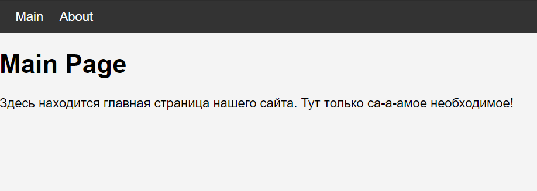
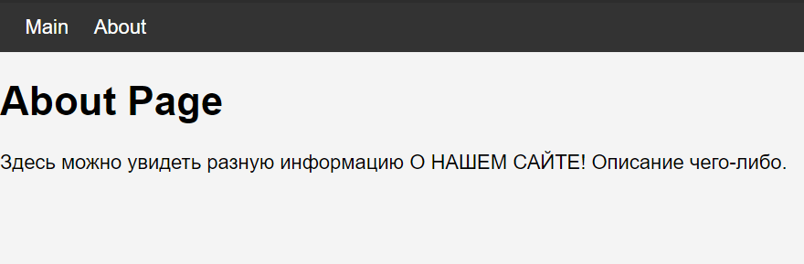
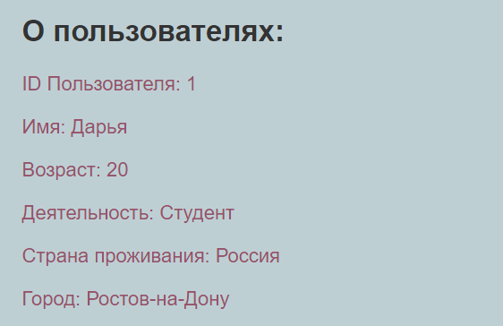
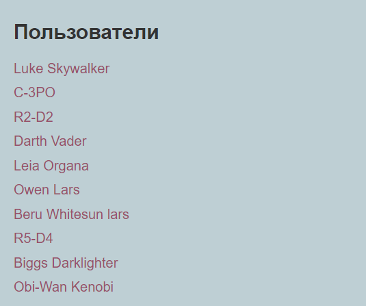
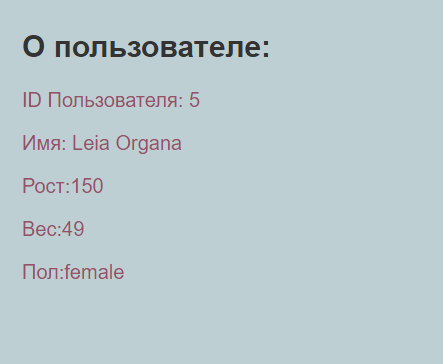

# React маршрутизация
___________________________________________________
## Лабораторная работа №10
#### Задание №1. 
> - сделать простой роутинг
> - одна страница main 
> - вторая about
> - навигацию между страницами

Файл About.js
```shell
import React from 'react';

const About = () => {
  return (
    <div>
      <h1>About Page</h1>
      <p>Здесь можно увидеть разную информацию О НАШЕМ САЙТЕ! Описание чего-либо.</p>
    </div>
  );
}

export default About;
```
Файл Main.js
```shell
import React from 'react';

const Main = () => {
  return (
    <div>
      <h1>Main Page</h1>
      <p>Здесь находится главная страница нашего сайта. Тут только са-а-амое необходимое!</p>
    </div>
  );
}

export default Main;
```
Файл App.js
```shell
import React from 'react';
import {BrowserRouter as Router, Routes, Route, Link} from 'react-router-dom';
import Main from './Main';
import About from './About';

function App() {
  return (
    <Router>
      <div>
        <nav>
          <ul>
            <li>
              <Link to="/">Main</Link>
            </li>
            <li>
              <Link to="/about">About</Link>
            </li>
          </ul>
        </nav>

        <Routes>
          <Route path="/" element={<Main />} />
          <Route path="/about" element={<About />} />
        </Routes>
      </div>
    </Router>
  );
}
```


#### Задание №2. 
> - на первой странице вывести пользователей
> - добавить переход при клике на пользователя на страницу с большей информацией
> - использоваться параметры в роутах 

Файл UsersList.js
```shell
import React from 'react';
import { Link } from 'react-router-dom';

const users = [
  { id: 1, name: 'Дарья' },
  { id: 2, name: 'Валерия' },
  { id: 3, name: 'София' },
];

const UsersList = () => {
  return (
    <div>
      <h2>Пользователи</h2>
      <ul>
        {users.map(user => (
          <li key={user.id}>
            <Link to={`/user/${user.id}`}>{user.name}</Link>
          </li>
        ))}
      </ul>
    </div>
  );
}

export default UsersList;
```
Файл User.js
```shell
import React from 'react';
import { useParams } from 'react-router-dom';
const users = [
    { id: 1, name: 'Дарья', age: 20, activity: 'Студент',  country: 'Россия', city: 'Ростов-на-Дону'},
    { id: 2, name: 'Валерия', age: 25, activity: 'Дизайнер', country: 'Россия', city: 'Краснодар'},
    { id: 3, name: 'София', age: 27, activity: 'Разработчик', country: 'Россия', city: 'Москва'}
  ];
const User = () => {
  let { id } = useParams();
  let user = users.find(user => user.id === parseInt(id));

  return (
    <div>
      <h2>О пользователях:</h2>
      {user && (
        <div>
        <p>ID Пользователя: {id}</p>
        <p>Имя: {user.name}</p>
        <p>Возраст: {user.age}</p>
        <p>Деятельность: {user.activity}</p>
        <p>Страна проживания: {user.country}</p>
        <p>Город: {user.city}</p>
        </div>
      )}
    </div>
  );
}

export default User;
```
Файл App.js
```shell
import React from 'react';
import { BrowserRouter as Router, Routes, Route } from 'react-router-dom';
import UsersList from './UsersList';
import User from './User';

function App() {
  return (
    <Router>
      <div>
        <Routes>
          <Route path="/" element={<UsersList />} />
          <Route path="/user/:id" element={<User />} />
        </Routes>
      </div>
    </Router>
  );
}

export default App;
```

Файл App.css
```shell
body {
  font-family: Arial, sans-serif;
  background-color: #becfd4;
  padding: 20px;
}
div{
  text-decoration: none;
  color: #97506a;
}
h2 {
  color: #333;
  margin-bottom: 20px;
}

ul {
  list-style: none;
  padding: 0;
}

li {
  margin-bottom: 10px;
}

a {
  text-decoration: none;
  color: #97506a;
}

a:hover {
  text-decoration: underline;
}

.user-info {
  background-color: #ffffff;
  padding: 20px;
  border-radius: 5px;
  box-shadow: 0 0 10px rgba(201, 176, 176, 0.1);
}

.user-info p {
  margin: 5px 0;
}
```


#### Задание №3. 
> - усложнить предыдущую стягиванием данных с сервера

Файл User.js
```shell
import React, { useState, useEffect } from 'react';
import { useParams } from 'react-router-dom';

const User = () => {
  const { id } = useParams();
  const [user, setUser] = useState(null);

  useEffect(() => {
    const fetchUserData = async () => {
      try {
        const response = await fetch(`https://swapi.dev/api/people/${id}/`);
        if (!response.ok) {
          throw new Error('Failed to fetch');
        }
        const userData = await response.json();
        setUser(userData);
      } catch (error) {
        console.error('Error fetching user data:', error);
      }
    };

    fetchUserData();
  }, [id]);

  return (
    <div>
      <h2>О пользователе:</h2>
      {user && (
        <div>
          <p>ID Пользователя: {id}</p>
          <p>Имя: {user.name}</p>
          <p>Рост:{user.height}</p>
          <p>Вес:{user.mass}</p>
          <p>Пол:{user.gender}</p>
        </div>
      )}
    </div>
  );
};

export default User;
```

Файл User.js
```shell
import React, { useState, useEffect } from 'react';
import { Link } from 'react-router-dom';

const UsersList = () => {
  const [users, setUsers] = useState([]);

  useEffect(() => {
    const fetchUsers = async () => {
      try {
        const response = await fetch('https://swapi.dev/api/people/');
        if (!response.ok) {
          throw new Error('Failed to fetch');
        }
        const userData = await response.json();
        setUsers(userData.results);
      } catch (error) {
        console.error('Error fetching users:', error);
      }
    };

    fetchUsers();
  }, []);

  return (
    <div>
      <h2>Пользователи</h2>
      <ul>
        {users.map((user, index) => (
          <li key={index + 1}>
            <Link to={`/user/${index + 1}`}>{user.name}</Link>
          </li>
        ))}
      </ul>
    </div>
  );
};

export default UsersList;
```
Файл App.js
```shell
import React from 'react';
import { BrowserRouter as Router, Routes, Route } from 'react-router-dom';
import UsersList from './UsersList';
import User from './User';

function App() {
  return (
    <Router>
      <div>
        <Routes>
          <Route path="/" element={<UsersList />} />
          <Route path="/user/:id" element={<User />} />
        </Routes>
      </div>
    </Router>
  );
}

export default App;
```

