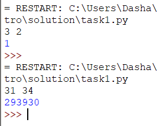
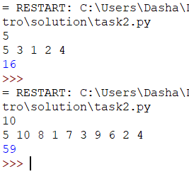
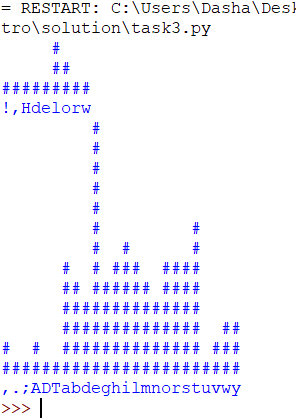

# Введение в Python
___________________________________________________
## Лабораторная работа №12
>#### Задание №1
Файл task1.py
```shell
def count_ways(N, M):
    arr = [[0]*M for _ in range(N)]
    arr[0][0] = 1
    
    for i in range(N):
        for j in range(M):
            if i-2 >= 0 and j-1 >= 0:
                arr[i][j] += arr[i-2][j-1]
            if i-1 >= 0 and j-2 >= 0:
                arr[i][j] += arr[i-1][j-2]
    
    return arr[N-1][M-1]

N, M = map(int, input().split())
print(count_ways(N, M))
```

>#### Задание №2
Файл task2.py
```shell
import heapq

def find_median(n, arr):
    
    max_sq, min_sq, result = [], [], 0
    
    for i in range(n):
        heapq.heappush(max_sq, -arr[i])  
        heapq.heappush(min_sq, -heapq.heappop(max_sq))
        
        if len(min_sq) > len(max_sq):
            heapq.heappush(max_sq, -heapq.heappop(min_sq))  
        result -= max_sq[0]  

    return result

n, arr =int(input()), list(map(int, input().split()))
print(find_median(n, arr))
```


>#### Задание №3
Файл task3.py
```shell
def text_histogram(input_text):
    count_ch = {}
    for char in input_text:
        if char not in (' ', '\n'):
            count_ch[char] = count_ch.get(char, 0) + 1
    max_count = max(count_ch.values())
    histogram = []
    for i in range(max_count, 0, -1):
        row = ''
        for char in sorted(count_ch.keys()):
            if count_ch[char] >= i:
                row += '#'
            else:
                row += ' '
        histogram.append(row)
    histogram.append(''.join(sorted(count_ch.keys())))
    return '\n'.join(histogram)

if __name__ == '__main__':
    files = ['2.txt', '1.txt']
    for file_name in files:
        with open(file_name, 'r') as file:
            input_text = file.read()
            print(text_histogram(input_text))
```
